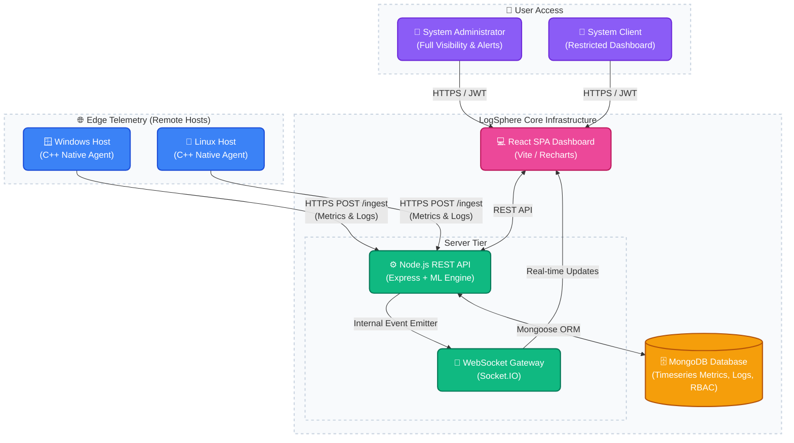

# LogSphere 🌐

<p align="center">
  <em>Real-time Multi-Platform System Monitoring, RBAC & Analytics Platform</em>
</p>

<p align="center">
  
  
  
  
  
</p>

---

## 📖 Overview

LogSphere is an advanced, end-to-end telemetry platform built to provide instant insights into your entire infrastructure. It aggregates raw diagnostics (CPU usage, Memory utilization, Process Counts) alongside error logs from disparate machines into a single, unified "pane of glass" dashboard. 

LogSphere features built-in **Multi-tenant RBAC (Role-Based Access Control)**, allowing Administrators to oversee entire fleets of devices while individual Clients can safely monitor only their own systems. Advanced features include **Machine Learning-based anomaly detection**, threshold-based **Alert Rules**, and real-time Socket.IO streaming.

---

## 🏗️ Architecture



---

## ✨ Key Features & Workflow

- 🔒 **Role-Based Access Control (RBAC)**: Secure multi-tenant architecture. Admins register first, and Clients register using their Admin's email to link accounts. Admins can view metrics across all clients, while clients only see their own telemetry.
- 🚀 **Zero-Dependency Agent Deployment**: A lightweight, native C++ agent code is built and deployed on the target machine (Windows/Linux) via OTA installation scripts. No Python or Java runtimes required!
- 📊 **Metric Collection**: The agent samples CPU, RAM, and captures new application log files down to the millisecond.
- 🛡️ **Secure Data Ingestion**: Polled data is sent securely to the Node.js Express Backend via the RESTful `/ingest` route using secure `systemKey` authorization.
- 🧠 **Data Aggregation & Machine Learning**: The backend logs raw metrics to MongoDB immediately while broadcasting them to connected users. Background jobs condense metrics into historical averages, and an ML layer analyzes trends for anomaly detection.
- 🔔 **Alert Rules Engine**: Users can define specific CPU and memory thresholds to receive real-time notifications when systems are under stress.
- ⚡ **Real-time Visualization**: Via established Socket.IO connections, visual charts, log tables, and metric widgets update instantaneously without ever needing to reload the webpage.

---

## 📁 Repository Structure

```text
logsphere/
├── agent/            # C++ Native Agent for Windows/Linux
│   ├── agent.cpp     # Cross-platform telemetry collection code
│   └── install.ps1   # PowerShell OTA Installer
├── server/           # Node.js Express Backend
│   ├── index.js      # Main Express / Socket.IO entry point
│   ├── controllers/  # API business logic (Auth, Ingest, Metrics)
│   ├── models/       # Mongoose Schemas
│   └── public/       # Hosted Agent binaries and installers
└── dashboard/        # React + Vite Frontend
    ├── src/
    │   ├── components/ # React UI Components
    │   ├── api/        # Axios configurations
    │   └── App.jsx     # Frontend Router
```

---

## 💻 Tech Stack

- **Agent**: Native C++ (Zero-dependency via `httplib.h` & `json.hpp`). Built for high efficiency and minimum footprint on Windows & Linux.
- **Backend API**: Node.js, Express, Mongoose, Socket.IO, JWT Authentication.
- **Frontend Dashboard**: React 19, Vite, React Router, Recharts.
- **Database**: MongoDB caching and timeseries functionality.

---

## 🚀 Getting Started

### Prerequisites
- **Node.js** (v18 or higher)
- **MongoDB** (Running locally on `127.0.0.1:27017` or configured via Mongoose URI)
- **C++ Compiler** (If building the native agent manually)

### 1. Database & Backend Setup
```bash
# Navigate to the backend server directory
cd server

# Install Node dependencies
npm install

# Establish Environment variables
# Create a .env file based on the provided .env.example
# e.g., JWT_SECRET=your_secret_key | MONGO_URI=mongodb://127.0.0.1:27017/logsphere | DASHBOARD_URL=http://localhost:5173

# Start the Node Application Backend
npm run dev
```

### 2. Frontend Dashboard Setup
```bash
# Open a new terminal session and navigate to the frontend directory
cd dashboard

# Install Frontend dependencies
npm install

# Start the Vite development server
npm run dev
```

> **Note**: Access the dashboard locally at `http://localhost:5173`. Upon your first visit, you will need to register an `Admin` account. Subsequent users can register as `Client` and provide the Admin's email to link their accounts.

### 3. Agent Integration
To connect an actual machine to your dashboard, you can deploy the native C++ agent over your network without compiling code on the target machine.

1. Generate a `systemId` and `systemKey` from inside your Dashboard UI (Devices tab).
2. Follow the deployment path for your target operating system:

**Over-The-Air (OTA) Linux Install**
Open a terminal on your Linux target machine and execute the bash installer:
```bash
curl -sL "http://localhost:5000/install.sh" | bash -s -- --systemId "MyLinuxBox" --systemKey "your-system-key-here" --ingestUrl "http://localhost:5000"
```
*The installer automatically downloads the native Linux binary and registers a secure `systemd` background service.*

**Over-The-Air (OTA) Windows Install**
Open a standard PowerShell window on your Windows target machine and execute the deployment script. *(This script places files into your local AppData, bypassing Administrator restrictions!)*
```powershell
Invoke-WebRequest -Uri "http://localhost:5000/install.ps1" -OutFile install.ps1; .\install.ps1 -systemId "MyWindowsBox" -systemKey "your-system-key-here" -ingestUrl "http://localhost:5000"
```
Launch the downloaded agent directly via:
```powershell
%LOCALAPPDATA%\LogSphere\logsphere-agent.exe
```

**Custom Log Tailing (Bonus)**
Want to see live application logs inside your dashboard? The agent defaults to scanning for an `app.log` file in its current working directory (e.g. `%LOCALAPPDATA%\LogSphere\app.log` or `/var/log/syslog`). Merely pipe any application errors to that file and the C++ Agent will intercept and stream them into your Dashboard's Live Log Console instantly!

---

## 🤝 Contributing
Contributions are highly encouraged! Please feel free to open a Pull Request.

## 📄 License
This project is licensed under the standard ISC License.