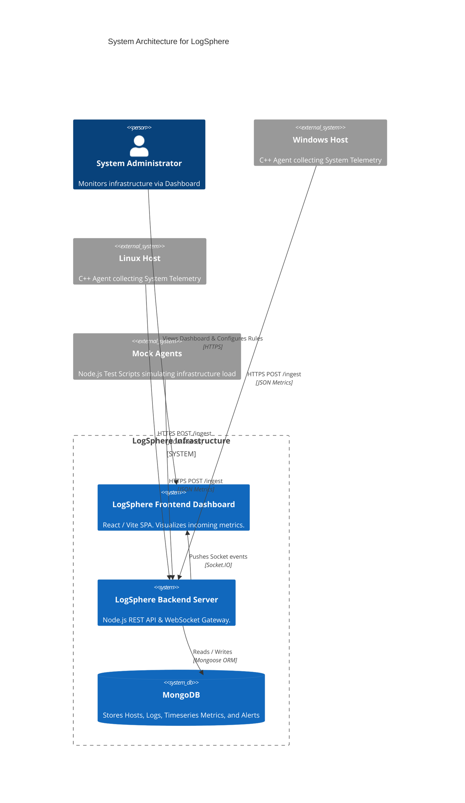

# LogSphere

<p align="center">
  <em>Real-time Multi-Platform System Monitoring & Analytics Platform</em>
</p>

## 📖 Overview
LogSphere is an end-to-end telemetry platform built to provide instant insights into your entire infrastructure. It aggregates raw diagnostics (CPU usage, Memory utilization, Process Counts) alongside error logs from disparate machines into a single, unified "pane of glass" dashboard.

## 🏗️ Architecture



## ⚙️ How It Works (Data Workflow)

1. **Agent Deployment**: A lightweight, native C++ agent code is built and deployed on the target machine (Windows/Linux).
2. **Metric Collection**: The agent samples CPU, RAM, and captures new application log files down to the millisecond.
3. **Data Ingestion**: Polled data is sent securely to the Node.js Express Backend via the RESTful `/ingest` route using secure `systemKey` authorization.
4. **Data Aggregation**: The backend logs raw metrics to MongoDB immediately while broadcasting them to connected Admins. Background cron jobs run automatically every 5 minutes and 1 hour to condense metrics into historical averages, saving database space.
5. **Real-time Visualization**: An Administrator accesses the React Dashboard. Via established Socket.IO connections, visual charts and metric widgets update instantaneously without ever needing to reload the webpage.

## 💻 Tech Stack Overview

- **Agent**: Native C++ (Zero-dependency via `httplib.h` & `json.hpp`). Built for high efficiency and minimum footprint.
- **Backend API**: Node.js, Express 5, Mongoose, Socket.IO.
- **Frontend Dashboard**: React 19, Vite, React Router, Recharts.
- **Database**: MongoDB caching and timeseries functionality.

---

## 🚀 Getting Started

### Prerequisites
- Node.js (v18 or higher)
- MongoDB (Running locally on `127.0.0.1:27017` or configured via Mongoose URI)
- C++ Compiler (If building the native agent manually)

### 1. Database & Backend Setup
```bash
# Navigate to the backend server directory
cd server

# Install Node dependencies
npm install

# Establish Environment variables
# Create a .env file based on the provided .env.example
# e.g., JWT_SECRET=your_secret_key | MONGO_URI=mongodb://127.0.0.1:27017/logsphere

# Start the Node Application Backend
node index.js
```
*(If installing on a production server, we recommend using PM2 to run via the root `ecosystem.config.js`).*

### 2. Frontend Dashboard Setup
```bash
# Open a new terminal session and navigate to the frontend directory
cd dashboard

# Install Frontend dependencies
npm install

# Start the Vite development server
npm run dev
```

> **Note**: Access the dashboard locally at `http://localhost:5173`. Upon your first visit, you will need to register an admin account to log in.

### 3. Agent Integration
To connect an actual machine to your dashboard, you can deploy the native C++ agent over your network without compiling code on the target machine.

1. Generate a `systemId` and `systemKey` from inside your Dashboard UI.
2. Follow the deployment path for your target operating system:

**Over-The-Air (OTA) Linux Install**
Open a terminal on your Linux target machine and execute the bash installer:
```bash
curl -sL "http://localhost:5000/install.sh" | bash -s -- --systemId "MyLinuxBox" --systemKey "your-system-key-here" --ingestUrl "http://localhost:5000"
```
*The installer automatically downloads the native Linux binary and registers a secure `systemd` background service.*

**Over-The-Air (OTA) Windows Install**
Open a standard PowerShell window on your Windows target machine and execute the deployment script. *(This script places files into your local AppData, bypassing Administrator restrictions!)*
```powershell
Invoke-WebRequest -Uri "http://localhost:5000/install.ps1" -OutFile install.ps1; .\install.ps1 -systemId "MyWindowsBox" -systemKey "your-system-key-here" -ingestUrl "http://localhost:5000"
```
Launch the downloaded agent directly via:
```powershell
%LOCALAPPDATA%\LogSphere\logsphere-agent.exe
```

**Custom Log Tailing (Bonus)**
Want to see live application logs inside your dashboard? The agent defaults to scanning for an `app.log` file in its current working directory (e.g. `%LOCALAPPDATA%\LogSphere\app.log` or `/var/log/syslog`). Merely pipe any application errors to that file and the C++ Agent will intercept and stream them into your Dashboard's Live Log Console instantly!

---

## 🤝 Contributing
Contributions are highly encouraged! Please feel free to open a Pull Request.

## 📄 License
This project is licensed under the standard ISC License.