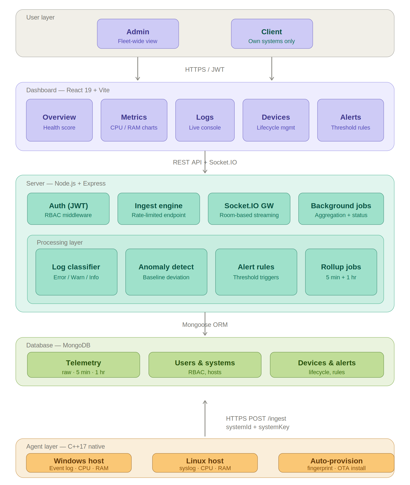

# LogSphere 🌐

<p align="center">
  <strong>Real-time Infrastructure Monitoring Platform with Multi-Tenant RBAC</strong>
</p>

<p align="center">
  
  
  
  
  
  
</p>

<p align="center">
  
  
</p>

---

## Overview

LogSphere is a full-stack telemetry platform that monitors CPU, memory, processes, and application logs across distributed infrastructure in real time. It features a native C++ agent (zero runtime dependencies), a Node.js backend with anomaly detection, and a React dashboard with live-updating charts.

## Screenshots

<p align="center">
  
</p>

<p align="center">
  
</p>

<p align="center">
  
</p>

<p align="center">
  
</p>

<p align="center">
  
</p>

**Key highlights:**
- One-command agent deployment (OTA install scripts for Linux & Windows)
- Multi-tenant RBAC — Admins oversee fleets, Clients see only their own systems
- Real-time streaming via Socket.IO (no page refreshes needed)
- Threshold-based alert rules with anomaly detection
- Historical comparison, trend analysis, and load forecasting
- Device lifecycle management (auto-discover → claim → monitor → offline detection)

---

## Architecture

<p align="center">
  
</p>

---

## Features

| Category | Feature | Description |
|----------|---------|-------------|
| **Auth** | Multi-tenant RBAC | Admin/Client roles, JWT-based auth, password reset via email |
| **Agent** | Zero-config install | One-command OTA deployment, auto-provisioning (no manual credentials) |
| **Agent** | Cross-platform | Native C++ for Windows (Event Log) and Linux (syslog) |
| **Monitoring** | Real-time metrics | CPU, memory, process count streamed every 5 seconds |
| **Monitoring** | Live log console | Classified logs (Error/Warning/Info) with search & filter |
| **Analytics** | Trend analysis | Detects rising/falling/stable patterns in CPU & memory |
| **Analytics** | Historical comparison | Today vs yesterday averages with % change |
| **Analytics** | Load forecasting | Predicts time-to-threshold (90%) based on current rates |
| **Analytics** | Health score | 0–100 composite score based on current metrics |
| **Alerts** | Threshold rules | Configurable CPU/memory thresholds with real-time notifications |
| **Alerts** | Anomaly detection | Baseline comparison flags spikes above 10% deviation |
| **Devices** | Lifecycle management | Pending → Claimed → Active → Offline state machine |
| **Devices** | Offline detection | 2-min server-side check + 30s client-side detection + socket events |
| **Admin** | Fleet overview | System selector to switch between all managed client systems |

---

## Tech Stack

| Layer | Technology | Purpose |
|-------|-----------|---------|
| Agent | C++17, httplib.h, nlohmann/json | Lightweight telemetry collection (no runtime deps) |
| Server | Node.js, Express 5, Mongoose | REST API, business logic, data persistence |
| Server | Socket.IO | Bidirectional real-time communication |
| Server | JWT, bcryptjs | Authentication and authorization |
| Server | express-rate-limit | API rate limiting per system |
| Database | MongoDB | Time-series metrics, logs, user/device records |
| Dashboard | React 19, Vite 7 | SPA with hot module replacement |
| Dashboard | Recharts | Interactive metric visualization |
| Dashboard | socket.io-client | Real-time data streaming |

---

## Project Structure

```
logsphere/
├── agent/                      # C++ native agent
│   ├── agent.cpp               # Cross-platform telemetry collector
│   ├── httplib.h               # HTTP client (header-only)
│   ├── json.hpp                # JSON library (header-only)
│   ├── Makefile                # Build configuration
│   ├── install.sh              # Linux OTA installer
│   └── install.ps1             # Windows OTA installer
├── server/                     # Node.js backend
│   ├── index.js                # Express + Socket.IO entry point
│   ├── config/database.js      # MongoDB connection
│   ├── controllers/            # Route handlers
│   │   ├── authController.js   # Login, register, refresh, password reset
│   │   ├── ingestController.js # Telemetry ingestion + anomaly detection
│   │   ├── metricsController.js# CPU/memory query endpoints
│   │   ├── logController.js    # Log retrieval
│   │   └── ...                 # Alert, trend, history, predict, etc.
│   ├── models/                 # Mongoose schemas
│   │   ├── telemetryModel.js   # Raw metrics (5s granularity)
│   │   ├── telemetry5minModel.js # 5-minute aggregates
│   │   ├── telemetry1hrModel.js  # 1-hour aggregates
│   │   ├── device.js           # Device lifecycle & provisioning
│   │   └── userModel.js        # Users with RBAC
│   ├── jobs/                   # Background workers
│   │   ├── aggregationJob.js   # Metric rollup (5min + 1hr)
│   │   └── deviceStatusJob.js  # Offline detection
│   ├── middleware/             # Auth middleware (JWT + system filtering)
│   ├── routes/                 # Express route definitions
│   └── public/                 # Served static files
│       ├── binaries/           # Agent binaries (Linux + Windows)
│       ├── install.sh          # Linux installer (served via curl)
│       └── install.ps1         # Windows installer (served via IWR)
├── dashboard/                  # React frontend
│   ├── src/
│   │   ├── App.jsx             # Router + Dashboard layout
│   │   ├── components/         # UI components (25+ modules)
│   │   ├── hooks/              # Custom React hooks
│   │   ├── api/axios.js        # API client configuration
│   │   └── socket.js           # Socket.IO client
│   └── vite.config.js          # Vite build config
└── ecosystem.config.js         # PM2 deployment config
```

---

## Getting Started

### Prerequisites

- **Node.js** v18+
- **MongoDB** (local or Atlas URI)
- **C++ compiler** (only if building the agent from source)

### 1. Clone the repository

```bash
git clone https://github.com/Yash021205/logsphere.git
cd logsphere
```

### 2. Backend setup

```bash
cd server
npm install
```

Create a `.env` file (see `.env.example`):

```env
PORT=5000
MONGO_URI=mongodb://127.0.0.1:27017/logsphere
JWT_SECRET=your_secret_key
CORS_ORIGIN=http://localhost:5173
DASHBOARD_URL=http://localhost:5173
```

Start the server:

```bash
npm run dev
```

### 3. Dashboard setup

```bash
cd dashboard
npm install
```

Create a `.env` file:

```env
VITE_API_URL=http://localhost:5000
```

Start the dashboard:

```bash
npm run dev
```

Access at `http://localhost:5173`

### 4. Agent deployment

**Linux** (run on target machine):

```bash
curl -sL "http://<server-ip>:5000/install.sh" | sudo bash -s -- --ingestUrl "http://<server-ip>:5000"
```

**Windows** (run in Administrator PowerShell):

```powershell
Invoke-WebRequest -Uri "http://<server-ip>:5000/install.ps1" -OutFile install.ps1; .\install.ps1 -ingestUrl "http://<server-ip>:5000"
```

After running, the device appears in the dashboard under **Devices → New Devices Detected**. Click **Claim Device** to start monitoring.

---

## Usage Flow

1. **Register** an Admin account on the dashboard
2. **Deploy** the agent on target machines using the install command
3. **Claim** devices as they appear in the Devices tab
4. **Monitor** real-time metrics in Overview and Metrics tabs
5. **Configure** alert thresholds in the Alert Rules tab
6. **Add Clients** — they register with your Admin email and claim their own devices
7. **Switch** between client systems using the System Selector dropdown

---

## API Endpoints

| Method | Endpoint | Auth | Description |
|--------|----------|------|-------------|
| POST | `/ingest` | systemKey | Telemetry data ingestion |
| POST | `/auth/register` | — | User registration |
| POST | `/auth/login` | — | JWT token generation |
| GET | `/auth/refresh` | JWT | Refresh token with latest systemId |
| GET | `/metrics/cpu` | JWT | CPU time-series data |
| GET | `/metrics/memory` | JWT | Memory time-series data |
| GET | `/logs` | JWT | Log entries (classified) |
| GET | `/hosts` | JWT | Registered hosts list |
| GET | `/trends` | JWT | CPU/memory trend analysis |
| GET | `/history` | JWT | Today vs yesterday comparison |
| GET | `/predict` | JWT | Load forecast predictions |
| GET | `/health` | JWT | System health score |
| GET | `/sla` | JWT | SLA compliance status |
| POST | `/api/devices/announce` | — | Agent self-registration |
| GET | `/api/devices/credentials` | — | Agent credential polling |
| POST | `/api/devices/claim/:id` | JWT | Claim a pending device |
| GET | `/api/devices/all` | JWT | List owned devices with status |
| GET | `/alert-rules` | JWT | Get alert rule config |
| PUT | `/alert-rules` | JWT | Update alert thresholds |

---

## Environment Variables

### Server (`server/.env`)

| Variable | Required | Description |
|----------|----------|-------------|
| `PORT` | No | Server port (default: 5000) |
| `MONGO_URI` | Yes | MongoDB connection string |
| `JWT_SECRET` | Yes | Secret for signing JWT tokens |
| `CORS_ORIGIN` | No | Allowed origins (default: *) |
| `DASHBOARD_URL` | No | Dashboard URL for password reset emails |
| `EMAIL_USER` | No | SMTP username for password reset |
| `EMAIL_PASS` | No | SMTP password for password reset |

### Dashboard (`dashboard/.env`)

| Variable | Required | Description |
|----------|----------|-------------|
| `VITE_API_URL` | Yes | Backend server URL |

---

## Contributing

Contributions are welcome! Please:

1. Fork the repository
2. Create a feature branch (`git checkout -b feature/my-feature`)
3. Commit your changes (`git commit -m 'Add my feature'`)
4. Push to the branch (`git push origin feature/my-feature`)
5. Open a Pull Request

---

## License

This project is licensed under the ISC License.